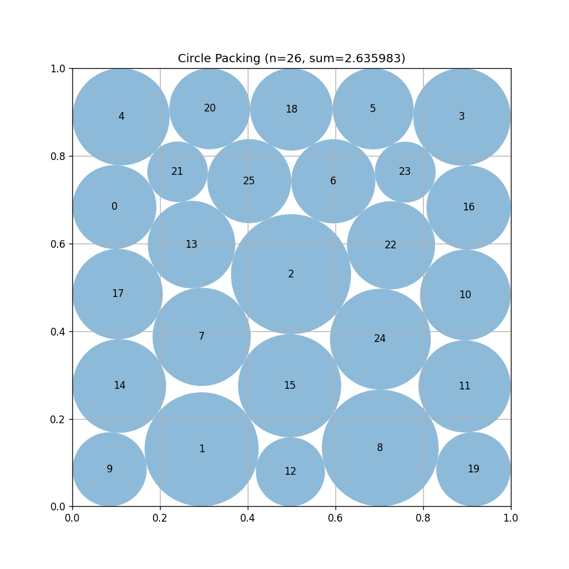

**TLDR** Reproduces the SOTA of 26 circles packing inside unit square, sum of radii `2.6359830849014761`
       (**certified feasible**, `combined_score = 1.0003730872`).   
       Used trivial YOLO ReAct agent powered by DeepSeek-V4.1-Flash.



Compare previous best report `2.635983084893607` by `pudepiedj` in Oct 19, 2025.  
https://github.com/algorithmicsuperintelligence/openevolve/issues/156#issuecomment-3419750877  
Compare previous best report `2.6359830853` by `Numaro` in July 3, 2026.  
https://numaro.tech/research/circle-packing-unit-square-2026/

## Corrected result

The agent's program as shipped returned `2.635982986575511`, not the `2.635983`
claimed above — a global "safety shrink" in the program was throwing away `9.4e-8`
(both bugs are analysed in `EXPERIMENT_LOG.md`). The result has been rescued and
improved, and is now a **certified** packing:

| | sum of radii | feasible? |
|---|---|---|
| AlphaEvolve (the `2.635` target) | `2.6358627562135460` | reference value baked into `evaluator.py` |
| Report on the OpenEvolve thread | `2.635983084893607` | not verified — a number a program printed |
| Best known published (Numaro / ThetaEvolve) | `2.6359830853` | reported as feasibility-checked |
| **This work** | **`2.6359830849014761`** | **yes — exact rational check, 0 violations** |

```
Evaluation: valid=True, sum_radii=2.635983, target=2.635, ratio=1.000373, time=0.17s
combined_score = 1.0003730872491372
```

The radii come with an exact certificate (`build_final2.py`): the pair distances
are computed at 80 digits and rounded *down* onto a rational grid, the split is
solved with a power-of-two-scaled LP so the solver's tolerance cannot leak in, and
the final radii are verified against all 377 constraints in exact `Fraction`
arithmetic with zero violations. The largest overlap is `-2.8e-17`, i.e. the
packing is strictly feasible rather than merely inside the evaluator's `1e-6`.

Note on comparison: this result **reproduces** the current best-known value, it does
not beat it. Against the numbers cited above:

- `+7.9e-12` over `pudepiedj`'s figure — but that figure is a number a program
  printed rather than a feasibility-checked result (SLSQP-style reports tolerate
  `1e-6` of violation), so beating it by `8e-12` is not meaningful on its own;
- `−4.0e-10` against Numaro's `2.6359830853`. That value also exceeds the pattern
  upper bound of the arrangement here (`2.6359830849151177`) by `3.9e-10`, so it
  must come from a different contact graph, i.e. a genuinely different layout;
- `+1.2e-4` over AlphaEvolve's reference value.

See `EXPERIMENT_LOG.md` for why the earlier search could not see differences at
the 1e-9 level, and why `rf_303`'s `2.6359831782` is an artefact (those radii
overlap by `9.9e-9`).


## Reproductibility

1. `git checkout f69f4d4`. This is the filesystem state before running. (exclude .git, and add an empty runs/ folder)
2. `docker build -t self_try_evolve:python-3.12.13-slim-trixie .`
3. `bash invoke.sh`.
4. The agent voluntarily exits at turn 46, leaving the filesystem state at `48ab8f9`. (exclude .git, and the runs/ folder is still empty). The agent claims that `EXPERIMENT_LOG.md` contain what it tries to say. Note that the `initial_program.py` is edited by the YOLO agent.
5. Rescue numerical errors: `python3 build_final2.py` to produce the final radii and the exact certificate.

## Credits and prior work

What this repo reuses, and under which licence:

### Reused code

| file(s) | origin | licence | state |
|---|---|---|---|
| `evaluator.py` | [OpenEvolve](https://github.com/algorithmicsuperintelligence/openevolve) — `examples/circle_packing/evaluator.py` | Apache-2.0 | reused verbatim |
| `snapshots/snapshot_00_initial.py` | OpenEvolve — `examples/circle_packing/initial_program.py` | Apache-2.0 | reused verbatim |
| `initial_program.py`, `snapshots/snapshot_0{2,3,4}*.py` | derived from the file above | Apache-2.0 | modified — change notice in the `initial_program.py` docstring |
| `oai_compat_chat.py`, `harness_tools.py`, `harness_tools_fixes.py`, `loop.py` | original code wrapping [LangChain](https://github.com/langchain-ai/langchain) and [deepagents](https://github.com/langchain-ai/deepagents) | MIT | no upstream source copied |

`evaluator.py` is intentionally left unmodified so the numbers stay comparable with
the upstream benchmark; `run_eval.py` only works around this sandbox reporting an
empty `sys.executable`.

### Benchmark lineage

The problem, the `TARGET_VALUE = 2.635` inside the evaluator, and the shape of the
evaluator itself come from AlphaEvolve (OpenEvolve's evaluator is based on it):

- Google DeepMind, AlphaEvolve results — `mathematical_results.ipynb`, section
  **B.12 “Packing circles inside a unit square to maximize sum of radii”** —
  <https://github.com/google-deepmind/alphaevolve_results> (Apache-2.0).

### Prior results compared

All values are as their sources state them, not re-measured:

| value | source | how it was obtained |
|---|---|---|
| `2.6358627562135460` | AlphaEvolve (Google DeepMind), § B.12 | published result; the `2.635` target in `evaluator.py` |
| `2.635977394756627` | [ypwang61, OpenEvolve#156](https://github.com/algorithmicsuperintelligence/openevolve/issues/156) (2025-07-21) | OpenEvolve run, `result_json` metrics |
| `2.635983` | [ArnaudDeza, OpenEvolve#156](https://github.com/algorithmicsuperintelligence/openevolve/issues/156#issuecomment-3156455197) (2025-08-05) | OpenEvolve run with Gemini models |
| `2.635983084893607` | [pudepiedj, OpenEvolve#156](https://github.com/algorithmicsuperintelligence/openevolve/issues/156#issuecomment-3419750877) (2025-10-19) | printed by an evolved program, `New best sum of radii: … on iteration 33` |
| `2.6359830853` | [Numaro, report NUMARO-2026-004](https://numaro.tech/research/circle-packing-unit-square-2026/) (2026-07-03); tied with ThetaEvolve | centres + LP referee with an overlap/wall checker, reported as feasibility-checked |

Two cautions. The `pudepiedj` figure is a number a program printed, not a
feasibility-checked result, so it is not strictly comparable to a certified value.
Numaro's figure is higher than everything here and its method is the same
centres-then-LP-referee approach used in this repo, so it is the number to beat.

The circle-packing problem itself is a classical one. Numaro pins its baselines
to Erich Friedman's *Circles in Squares* table, which together with
[packomania](http://www.packomania.com/) is the usual reference for best-known
packings; neither is the source of any code here.

## License

Apache-2.0 — see [LICENSE](LICENSE). Reused third-party components keep their own
licences, listed under [Credits and prior work](#credits-and-prior-work).

## Citation

```bibtex
@software{ocelopus2026circlePacking,
  title     = {Certified 26-circle packing in the unit square},
  author    = {ocelopus},
  year      = {2026},
  publisher = {GitHub},
  url       = {https://github.com/ocelopus/reproduce_sota_26_circle_packing}
}
```
